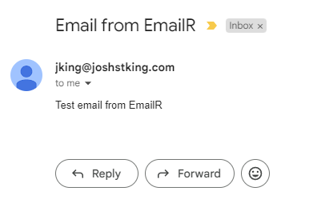

# EmailR

# Summary
EmailR is an email service written in Rust

## Getting Started

1. Check if rust is installed
```sh
which rustc
```

If rust is not installed install it
```sh
curl --proto '=https' --tlsv1.2 -sSf https://sh.rustup.rs | sh
```

2. Run a local instance of RabbitMQ
```sh
docker run -it --rm --name rabbitmq -p 5672:5672 -p 15672:15672 rabbitmq:3.13-management
```

3. Add your environment variables
```sh
cp example.env .env
```
Make sure to update with your credentials

4. Start the app
```sh
cargo run
```

## Sending an email

Once the app is started you can send an email by adding a message to the RabbitMQ queue.

Message Example:
```json
{
  "to": "josh.st.king@gmail.com",
  "from": "jking@joshstking.com",
  "subject": "Email from EmailR",
  "body": "<p>Test123</p>"
}
```


